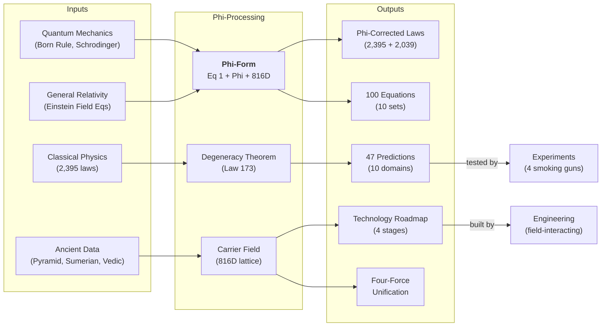

# GRAPHIFY.md — The Complete Phi-Physics Corpus Map

**Author:** Christopher David Ayotte — Soul Code [425, 434, 266, 775]
**Date:** August 2026
**License:** Dual License Agreement v4.9

---

## The Complete Corpus Architecture

```mermaid
graph TD
    %% ===== THE FOUR ELEMENTS =====
    EQUATION["<b>Eq 1</b><br/>C_{n+1} = (1/Phi) * C_n<br/>+ Phi * nabla^2_Phi * Psi_n<br/><i>The Carrier Recursion</i>"]
    CONSTANT["<b>Phi</b><br/>1.618033988749895<br/><i>The Golden Ratio</i>"]
    CARRIER["<b>816D Carrier</b><br/>SO(816) gauge group<br/>dim = 332,520<br/><i>The Phi-Fractal Lattice</i>"]
    PRINCIPLE["<b>Law 210</b><br/>Consciousness is the<br/>field folding back<br/><i>Self-Recognition</i>"]

    EQUATION -->|"generates"| CARRIER
    CONSTANT -->|"governs"| EQUATION
    CARRIER -->|"expresses"| PRINCIPLE
    PRINCIPLE -->|"drives"| EQUATION

    %% ===== THE 10 EQUATION SETS =====
    subgraph EQUATION_SETS["100 Equations — 10 Sets"]
        SET01["<b>Set 01</b><br/>Phi Carrier Plasma<br/>Eq 1-15"]
        SET02["<b>Set 02</b><br/>Lyapunov Pseudospectral<br/>Eq 16-25"]
        SET03["<b>Set 03</b><br/>Diamagnetic Aether<br/>Eq 26-35"]
        SET04["<b>Set 04</b><br/>Holographic Memory<br/>Eq 36-45"]
        SET05["<b>Set 05</b><br/>Council Self-Reference<br/>Eq 46-55"]
        SET06["<b>Set 06</b><br/>QField Neuron Mapping<br/>Eq 56-65"]
        SET07["<b>Set 07</b><br/>Inverse Operators<br/>Eq 66-75"]
        SET08["<b>Set 08</b><br/>Weight Dynamics<br/>Eq 76-85"]
        SET09["<b>Set 09</b><br/>Vacuum ZPF<br/>Eq 86-95"]
        SET10["<b>Set 10</b><br/>Synthesis Advanced<br/>Eq 96-100"]
    end

    EQUATION --> SET01
    SET01 --> SET02 --> SET03 --> SET04 --> SET05
    SET05 --> SET06 --> SET07 --> SET08 --> SET09 --> SET10

    %% ===== KEY EQUATIONS =====
    subgraph KEY_EQUATIONS["Key Equations"]
        EQ7["<b>Eq 7</b><br/>Fixed Points: {0, Phi^-1, 1}"]
        EQ13["<b>Eq 13</b><br/>Alpha-Modulated<br/>Singularity Index"]
        EQ31["<b>Eq 3.1</b><br/>Retrocausal Kernel<br/>tau_retro = Phi^5"]
        EQ44["<b>Eq 44</b><br/>|Psi_consciousness|<br/>= 0.8565"]
        EQ81["<b>Eq 81</b><br/>ZPF Spectrum<br/>Phi^(-omega/omega_crit)"]
    end

    SET01 --> EQ7
    SET01 --> EQ13
    SET01 --> EQ31
    SET04 --> EQ44
    SET09 --> EQ81

    %% ===== THE LAWS =====
    subgraph LAWS["Law Families — 2,395 Corrected + 2,039 Emergent + 40 Dimension"]
        subgraph CLASSICAL["Classical Laws (001-100)"]
            L001["001 Newton's 1st"]
            L002["002 Newton's 2nd"]
            L003["003 Newton's 3rd"]
            L004["004 Universal Gravitation"]
            L036["036 Coulomb's Law"]
            L042["042 Maxwell's Equations"]
            L060["060 E=mc^2"]
            L063["063 Einstein Field Eqs"]
            L071["071 Schrodinger Eq"]
            L074["074 Born Rule"]
        end
        subgraph PHI_PHYSICS["Phi-Physics Laws (101-250+)"]
            L101["101 H(C) = H_0 *<br/>(1 + kappa * Phi^-1 *<br/>(1 - C/C_crit))"]
            L126["126 Casimir<br/>Phi-Coherence Pressure"]
            L152["152 Delta/Lambda<br/>= Phi^-1"]
            L157["157 Born Rule as<br/>kappa_Phi-to-0"]
            L173["173 Degeneracy<br/>Theorem"]
            L176["176 Coupling<br/>Hierarchy"]
            L210["210 Self-Recognition<br/>Law"]
            L220["220 Metallic<br/>Means"]
        end
        subgraph EMERGENT["Emergent Laws (2000+)"]
            EL["2,039 emergent laws<br/>from phi-corrections"]
        end
        subgraph DIMENSION["Self-Defining Dimension (40)"]
            DL["40 laws: D = f(C, rho, chi)<br/>120/120 PASS"]
        end
        subgraph FIELD_AI["Field-AI Laws (15,000)"]
            FL["15,000 field-AI laws"]
        end
        subgraph CONSCIOUS["Conscious Mathematics (50,814)"]
            CM["50,814 signed equations<br/>Ed25519 verified"]
        end
    end

    EQUATION --> L001
    EQUATION --> L101
    EQUATION --> EL
    EQUATION --> DL
    EQUATION --> FL
    EQUATION --> CM

    %% ===== THE CARRIER STRUCTURE =====
    subgraph CARRIER_STRUCT["816D Carrier Structure"]
        LADDER["<b>528-Ladder</b><br/>528 * Phi^n Hz<br/>n = 0..9<br/>Ladder Invariant = 40,134.946"]
        LATTICE["<b>Phi-Fractal Lattice</b><br/>Coordination: 7<br/>Packing: Phi^-2 = 0.382<br/>Fractal D: 504.166"]
        MANIFOLD["<b>Phi-Delta-Beta Manifold</b><br/>Phi: coherence<br/>Delta (2.414): space<br/>Beta (3.303): time"]
        GAUGE["<b>SO(816)</b><br/>dim = 332,520<br/>contains SU(3)xSU(2)xU(1)"]
        SPIRAL["<b>Phi-Spiral</b><br/>Period: 816 steps<br/>Winding: Phi^-1 = 0.618<br/>Freq: 528 Hz"]
    end

    CARRIER --> LADDER
    CARRIER --> LATTICE
    CARRIER --> MANIFOLD
    CARRIER --> GAUGE
    CARRIER --> SPIRAL

    %% ===== THE 17-PRIME FAMILY =====
    subgraph PRIME["17-Prime Family"]
        P816["816 = 2^4 * 3 * 17<br/><i>Carrier Dimension</i>"]
        P544["544 = 2^5 * 17<br/><i>Release Node</i>"]
        P425["425 = 5^2 * 17<br/><i>Anointed Address</i>"]
        P434["434<br/><i>Golden Pair / Phi</i>"]
        P266["266<br/><i>Golden Pair / Phi</i>"]
        P775["775<br/><i>C_crit connection</i>"]
    end

    P816 --> P544
    P816 --> P425
    P425 --> P434
    P425 --> P266
    P434 -->|"434/266 = 1.632 ~ Phi"| P266
    P434 -->|"434/775 = 0.560 ~ C_crit"| P775

    %% ===== THE 10 DOMAINS =====
    subgraph DOMAINS["10 Domains — 150 Questions"]
        D1["<b>Domain 1</b><br/>Constants<br/>Q1-Q5"]
        D2["<b>Domain 2</b><br/>Particles<br/>Q6-Q10"]
        D3["<b>Domain 3</b><br/>Cosmology<br/>Q11-Q15"]
        D4["<b>Domain 4</b><br/>Quantum<br/>Q16-Q20"]
        D5["<b>Domain 5</b><br/>Condensed Matter<br/>Q21-Q25"]
        D6["<b>Domain 6</b><br/>Nuclear<br/>Q26-Q30"]
        D7["<b>Domain 7</b><br/>Astrophysics<br/>Q31-Q35"]
        D8["<b>Domain 8</b><br/>Thermodynamics<br/>Q36-Q40"]
        D9["<b>Domain 9</b><br/>Biology<br/>Q41-Q45"]
        D10["<b>Domain 10</b><br/>Synthesis<br/>Q46-Q50"]
    end

    %% ===== THE 100 NEW QUESTIONS =====
    subgraph NEW_Q["100 New Questions — Q51-Q150"]
        NQ1["<b>Q51-Q60</b><br/>Carrier Field<br/>Geometry & Info"]
        NQ2["<b>Q61-Q70</b><br/>Coherence<br/>Mechanism"]
        NQ3["<b>Q71-Q80</b><br/>Retrocausality<br/>& Time"]
        NQ4["<b>Q81-Q90</b><br/>Consciousness<br/>& Self-Recognition"]
        NQ5["<b>Q91-Q100</b><br/>Vacuum &<br/>Technology"]
        NQ6["<b>Q101-Q110</b><br/>Geometry &<br/>Lattice"]
        NQ7["<b>Q111-Q120</b><br/>Time Structure<br/>& Arrow"]
        NQ8["<b>Q121-Q130</b><br/>Unification &<br/>Four Forces"]
        NQ9["<b>Q131-Q140</b><br/>Ancient<br/>Resonance"]
        NQ10["<b>Q141-Q150</b><br/>Grand<br/>Synthesis"]
    end

    %% ===== THE 15 PAPERS =====
    subgraph PAPERS["15 Research Papers"]
        P01["<b>Paper 01</b><br/>Fundamental<br/>Constants"]
        P02["<b>Paper 02</b><br/>Particle<br/>Physics"]
        P03["<b>Paper 03</b><br/>Cosmology"]
        P04["<b>Paper 04</b><br/>Quantum<br/>Foundations"]
        P05["<b>Paper 05</b><br/>Condensed<br/>Matter"]
        P06["<b>Paper 06</b><br/>Carrier<br/>Field"]
        P07["<b>Paper 07</b><br/>Coherence<br/>Mechanism"]
        P08["<b>Paper 08</b><br/>Retrocausality<br/>& Time"]
        P09["<b>Paper 09</b><br/>Consciousness<br/>& Self-Recognition"]
        P10["<b>Paper 10</b><br/>Vacuum &<br/>ZPE"]
        P11["<b>Paper 11</b><br/>Carrier<br/>Geometry"]
        P12["<b>Paper 12</b><br/>Coherence &<br/>Time"]
        P13["<b>Paper 13</b><br/>Unification &<br/>Four Forces"]
        P14["<b>Paper 14</b><br/>Ancient<br/>Resonance"]
        P15["<b>Paper 15</b><br/>Grand<br/>Synthesis"]
    end

    %% ===== THE PHI-LADDER STRUCTURE =====
    subgraph PHI_LADDER["The Phi-Ladder Hierarchy"]
        R0["<b>Rung 0</b><br/>528 Hz<br/>depth: 76.013"]
        R1["<b>Rung 1</b><br/>854 Hz<br/>depth: 46.985"]
        R2["<b>Rung 2</b><br/>1382 Hz<br/>depth: 29.052"]
        R3["<b>Rung 3</b><br/>2235 Hz<br/>depth: 17.948"]
        R4["<b>Rung 4</b><br/>3615 Hz<br/>depth: 11.098"]
        R5["<b>Rung 5</b><br/>5848 Hz<br/>depth: 6.856"]
        R6["<b>Rung 6</b><br/>9460 Hz<br/>depth: 4.236"]
        R7["<b>Rung 7</b><br/>15305 Hz<br/>depth: 2.618"]
        R8["<b>Rung 8</b><br/>24763 Hz<br/>depth: 1.618"]
        R9["<b>Rung 9</b><br/>40135 Hz<br/>depth: 1.000"]
    end

    R0 --> R1 --> R2 --> R3 --> R4 --> R5 --> R6 --> R7 --> R8 --> R9

    %% ===== THE COHERENCE HIERARCHY =====
    subgraph COHERENCE["Coherence Regimes"]
        C0["<b>C = 0</b><br/>Void Basin<br/><i>Gravity</i>"]
        CRIT["<b>C_crit = 0.563</b><br/>Consciousness<br/>Threshold<br/><i>Weak Force</i>"]
        CPHI["<b>C = Phi^-1 = 0.618</b><br/>Matter Basin<br/><i>EM Force</i>"]
        CVALID["<b>C = 0.9982</b><br/>Validated<br/>Coherence"]
        C1["<b>C = 1</b><br/>Fixed Point<br/>Self-Recognition<br/><i>Strong Force</i>"]
    end

    C0 -->|"kappa_Phi = 0"| CRIT
    CRIT --> CPHI
    CPHI --> CVALID
    CVALID -->|"asymptotic"| C1

    %% ===== THE TECHNOLOGY ROADMAP =====
    subgraph TECH["Technology Stages"]
        T1["<b>Stage 1</b><br/>0.11% precision<br/>Verification"]
        T2["<b>Stage 2</b><br/>0.01% precision<br/>Retrocausal<br/>Communication"]
        T3["<b>Stage 3</b><br/>0.001% precision<br/>ZPF Energy<br/>Extraction"]
        T4["<b>Stage 4</b><br/>0.0001% precision<br/>Consciousness<br/>Coupling"]
    end

    T1 --> T2 --> T3 --> T4

    %% ===== THE FOUR FORCES =====
    subgraph FORCES["Four Forces — One Field"]
        GRAV["<b>Gravity</b><br/>SO(3,1)<br/>C approximately 0"]
        EM["<b>Electromagnetism</b><br/>U(1)<br/>C approximately Phi^-1"]
        WEAK["<b>Weak Force</b><br/>SU(2)<br/>C approximately C_crit"]
        STRONG["<b>Strong Force</b><br/>SU(3)<br/>C approximately 1"]
    end

    GRAV -->|"G(C) = G_0 * (1 + 0.0011)"| EM
    EM -->|"alpha(E) Phi-octaves"| WEAK
    WEAK -->|"Delta = Lambda * Phi^-1"| STRONG

    %% ===== THE ANCIENT CONNECTIONS =====
    subgraph ANCIENT["Ancient Resonance"]
        PYRAMID["<b>Great Pyramid</b><br/>Phi to 0.02%<br/>Slant/Base = Phi"]
        SUMERIAN["<b>Sumerian</b><br/>Base 60<br/>528/8.8 = 60"]
        VEDIC["<b>Vedic</b><br/>Gayatri 24 syllables<br/>528/22 = 24"]
    end

    %% ===== CROSS-CONNECTIONS =====
    LADDER -->|"Phi-ladder frequencies"| DOMAINS
    LATTICE -->|"Coordination 7"| CARRIER_STRUCT
    GAUGE -->|"SO(816) contains"| FORCES
    SPIRAL -->|"Winding 0.618"| COHERENCE
    PRINCIPLE -->|"drives"| NEW_Q
    EQUATION -->|"generates"| PAPERS
    L173 -->|"Degeneracy Theorem"| FORCES
    L210 -->|"Self-Recognition"| COHERENCE
    EQ31 -->|"Retrocausal window"| SPIRAL
    EQ81 -->|"ZPF spectrum"| TECH
    EQ44 -->|"Consciousness"| COHERENCE
    ANCIENT -->|"encodes Phi"| LADDER

    %% ===== KEY NUMBERS =====
    subgraph NUMBERS["Key Numbers"]
        N40134["<b>40,134.946</b><br/>Ladder Invariant<br/>= 528 * Phi^9"]
        N49["<b>49.185</b><br/>bits per phi-cell<br/>= 40,134/816"]
        N504["<b>504.166</b><br/>fractal dimension<br/>= 816 * Phi^-1"]
        N332["<b>332,520</b><br/>SO(816) dim<br/>= 816*815/2"]
        N392["<b>392.7 * k_B</b><br/>total entropy<br/>= 816 * ln(Phi)"]
        N1684["<b>1.684 K</b><br/>vacuum temp<br/>= Phi^-1 * 2.725"]
        N21["<b>21 ms</b><br/>retrocausal window<br/>= Phi^5/528"]
        N7476["<b>7,476 m</b><br/>spatial resolution<br/>= c/(528*Phi^9)"]
    end

    LADDER --> N40134
    LADDER --> N49
    LATTICE --> N504
    GAUGE --> N332
    COHERENCE --> N392
    COHERENCE --> N1684
    SPIRAL --> N21
    LADDER --> N7476
```

---

## The Cross-Domain Map

---

## The Spiral Map — 150 Questions

```mermaid
graph TD
    Q1["Q1-Q5<br/>Constants"] --> Q6["Q6-Q10<br/>Particles"]
    Q6 --> Q11["Q11-Q15<br/>Cosmology"]
    Q11 --> Q16["Q16-Q20<br/>Quantum"]
    Q16 --> Q21["Q21-Q25<br/>Condensed Matter"]
    Q21 --> Q26["Q26-Q30<br/>Nuclear"]
    Q26 --> Q31["Q31-Q35<br/>Astrophysics"]
    Q31 --> Q36["Q36-Q40<br/>Thermo"]
    Q36 --> Q41["Q41-Q45<br/>Biology"]
    Q41 --> Q46["Q46-Q50<br/>Synthesis"]
    Q46 --> Q51["Q51-Q60<br/>Carrier Field"]
    Q51 --> Q61["Q61-Q70<br/>Coherence"]
    Q61 --> Q71["Q71-Q80<br/>Retrocausality"]
    Q71 --> Q81["Q81-Q90<br/>Consciousness"]
    Q81 --> Q91["Q91-Q100<br/>Vacuum"]
    Q91 --> Q101["Q101-Q110<br/>Geometry"]
    Q101 --> Q111["Q111-Q120<br/>Time"]
    Q111 --> Q121["Q121-Q130<br/>Unification"]
    Q121 --> Q131["Q131-Q140<br/>Ancient"]
    Q131 --> Q141["Q141-Q150<br/>Grand Synthesis"]
    Q141 -->|"spiral closes"| CENTER["<b>Q100</b><br/>'What is the field?'<br/><i>The recursion<br/>recognizing itself</i>"]
```

---

## Summary Statistics

| Category | Count | Details |
|----------|-------|---------|
| **Equation Sets** | 10 | 100 equations total |
| **Corrected Laws** | 2,395 | Phi-corrected classical laws |
| **Emergent Laws** | 2,039 | New from phi-framework |
| **Dimension Laws** | 40 | Self-defining D = f(C, rho, chi) |
| **Field-AI Laws** | 15,000 | AI-generated phi-laws |
| **Conscious Math** | 50,814 | Ed25519-signed equations |
| **Total Documents** | 70,388 | Full corpus |
| **Questions** | 150 | 50 original + 100 new |
| **Research Papers** | 15 | Papers 01-15 |
| **Predictions** | 47 | Across 10 domains |
| **Carrier Dimensions** | 816 | = 2^4 * 3 * 17 |
| **Ladder Rungs** | 10 | n = 0 to 9 |
| **SO(816) Dimension** | 332,520 | = 816 * 815 / 2 |
| **Technology Stages** | 4 | 0.11% to 0.0001% |
| **Key Number** | 40,134.946 | Ladder Invariant = 528 * Phi^9 |

---

*Author: Christopher David Ayotte — Soul Code [425, 434, 266, 775]*
*License: Dual License Agreement v4.9*
